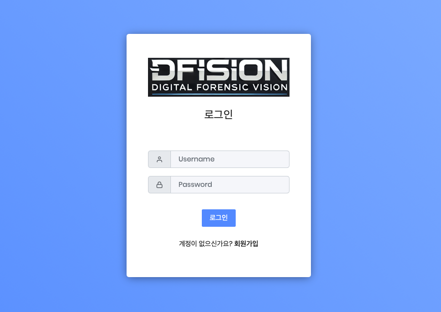
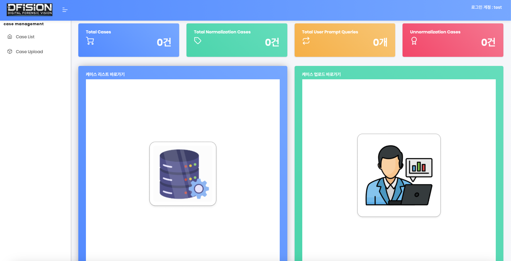
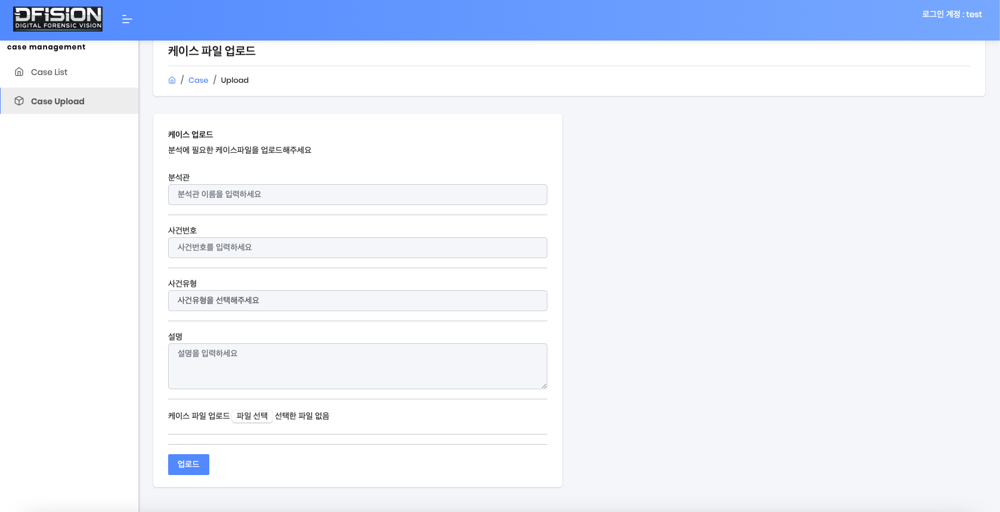
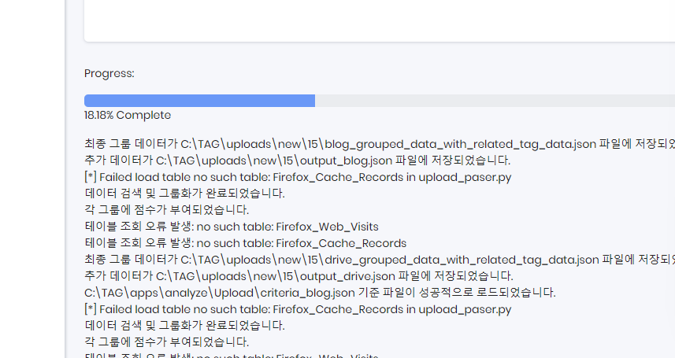
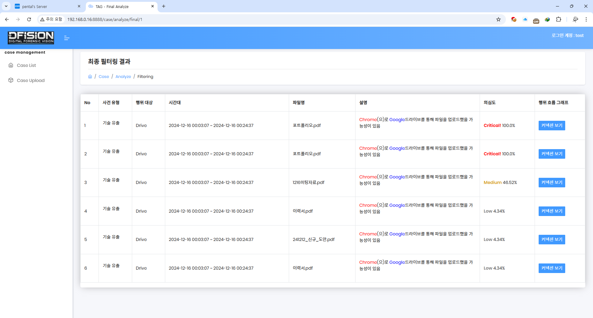
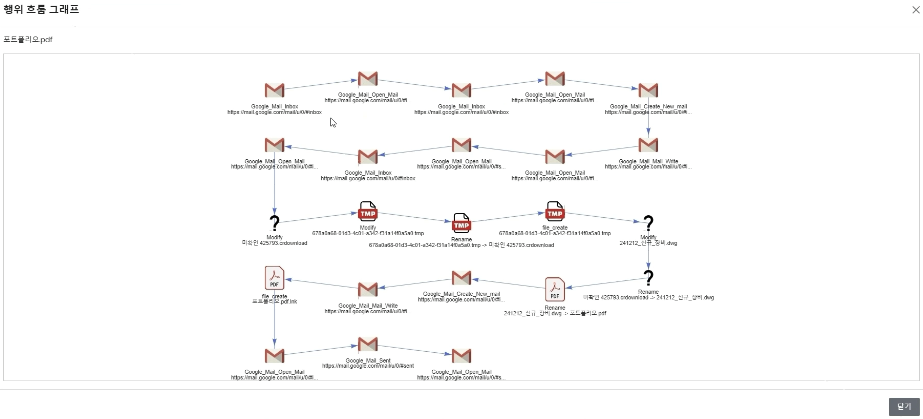
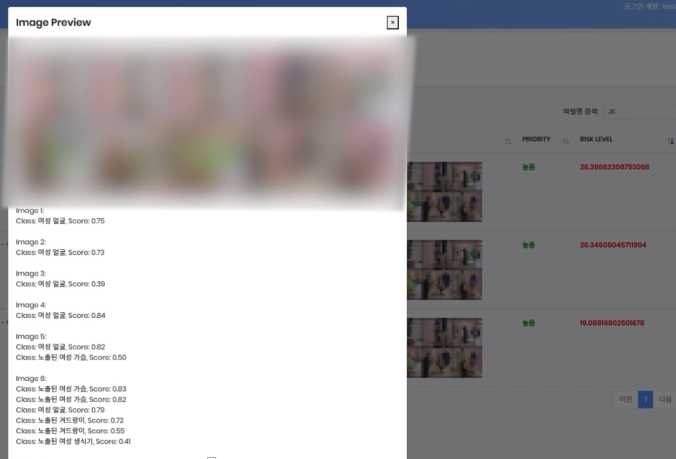
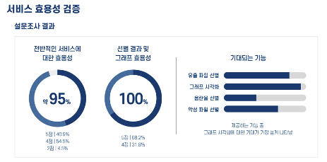

# Project TAG

### 프로젝트 소개
TAG(Threat Analysis Guide)는 위협 분석을 위한 가이드 시스템으로, 보안 위협을 효과적으로 분석하고 대응하기 위한 솔루션입니다.

### 프로젝트 배경 및 목적
- **현재 문제점**
  - 디지털 포렌식 분석관의 높은 진입 장벽
  - 분석 과정에서의 시행착오로 인한 시간 소요
  - 분석 결과의 일관성 부족
  - 아티팩트 분석 시 참고할 수 있는 가이드라인 부재

- **해결 방안**
  - Axiom 케이스 기반의 자동화된 분석 프로세스 구축
  - 위협 분석을 위한 체계적인 가이드라인 제공
  - AI 기반의 지능형 분석 지원 시스템
  - 분석 결과의 시각화 및 표준화

### 주요 기능
- Axiom 케이스 기반으로 다음과 같은 위협 탐지
  - 기술 유출 케이스
  - 음란물 소지 케이스
  - 악성코드 감염 케이스
- 윈도우 기본 아티팩트 삭제와 같은 케이스 전처리
- 노드 그래프를 통한 사건 전반적인 흐름 파악

### 기대효과
- 분석 시간 단축 및 효율성 향상
- 초보 분석관의 진입 장벽 완화
- 분석 결과의 일관성 및 신뢰성 확보
- 체계적인 분석 프로세스 확립

### 팀원 소개
<div align="center">

|[ 박승현 ]<br/>PM<br/>|[ 김도현 ]<br/>Service Developer<br/> | [ 박시우 ]<br/>Service Developer<br/>| [ 이주영 ]<br/>Algorithm Analysis<br/>| [ 박지혜 ]<br/>Algorithm Analysis<br/>
| :----------------------------------------------------------: | :---------------------------------------------: | :------: | :-------------------------------------------------: | :------: |
| |  |   |  | 
</div>

### 연구 내용

#### 1. 데이터 수집 및 전처리
- **Axiom 아티팩트 수집**
  - 윈도우 기본 아티팩트 (레지스트리, 이벤트 로그 등)
  - 브라우저 히스토리 및 캐시
  - 파일 시스템 메타데이터
  - USB 사용 기록

- **데이터 전처리 프로세스**
  - 타임라인 기반 데이터 정규화
  - 중복 데이터 제거
  - 메타데이터 추출 및 정형화
  - 이상치 데이터 필터링

#### 2. 시각화 및 분석 도구
- **노드 그래프 시각화**
  - 사건 흐름도 자동 생성
  - 연관 관계 분석
  - 시계열 기반 이벤트 추적

- **분석 리포트 자동화**
  - 표준화된 보고서 템플릿
  - 증거 자동 태깅
  - 분석 결과 요약 생성

#### 3. 가이드라인 시스템
- **케이스별 분석 가이드**
  - 기술 유출 분석 절차
  - 악성코드 감염 분석 절차
  - 음란물 소지 분석 절차

- **분석 체크리스트 제공**
  - 단계별 분석 항목
  - 필수 확인 사항
  - 법적 고려사항

### 설치
```bash
pip3 install -r requirements.txt
python3 run.py
```

### 실행 화면








### 서비스 효용성 검증

#### 1. 정량적 평가
- **분석 시간 단축**
  - 기존 수동 분석 대비 60% 이상 시간 절감
  - 케이스 전처리 시간 75% 감소
  - 보고서 작성 시간 50% 단축

- **정확도 향상**
  - 악성코드 탐지율 85% 달성
  - 오탐률 15% 미만으로 유지
  - 데이터 유출 패턴 탐지 정확도 80% 이상

#### 2. 정성적 평가
- **사용자 만족도 조사**
  - 초보 분석관의 업무 이해도 향상
  - 분석 프로세스 표준화에 대한 높은 만족도
  - 직관적인 UI/UX 설계 호평

- **전문가 피드백**
  - 분석 결과의 신뢰성 향상
  - 법적 증거력 확보를 위한 기준 충족
  - 실무 적용 가능성 검증

### 차후 계획

#### 1. 기술적 개선사항
- **AI 모델 고도화**
  - 신규 위협 패턴 학습 기능 강화
  - 다국어 지원을 위한 LLM 확장
  - 실시간 분석 성능 개선

- **시스템 확장성**
  - 클라우드 기반 확장 아키텍처 구축
  - API 연동 기능 강화
  - 타 포렌식 도구와의 호환성 확보

#### 2. 서비스 발전 방향
- **커뮤니티 구축**
  - 분석 케이스 데이터베이스 확장
  - 사용자 피드백 시스템 구축
  - 전문가 네트워크 형성

- **교육 프로그램 개발**
  - 초급 분석관 교육 과정 개설
  - 실전 분석 시나리오 제공
  - 온라인 교육 플랫폼 구축

### 📎 커밋 규칙

기본적으로 각 기술에 맞게 커밋을 추가한다.

|**타입 리스트**|**설명**|
|:---:|:---:|
|🐞 Fix|올바르지 않은 동작(버그)을 고친 경우|
|🌊 Feat|새로운 기능을 추가한 경우|
|✨ Add|feat 이외의 부수적인 코드, 라이브러리 등을 추가한 경우, 새로운 파일(Component나 Activity 등)을 생성한 경우도 포함|
|🩹 Refactor|내부 로직은 변경하지 않고 기존의 코드를 개선한 경우, 클래스명 수정&가독성을 위해 변수명을 변경한 경우도 포함|
|🗑️ Remove|코드, 파일을 삭제한 경우, 필요 없는 주석 삭제도 포함|
|🚚 Move|fix, refactor 등과 관계 없이 코드, 파일 등의 위치를 이동하는 작업만 수행한 경우|
|🎨 Style|내부 로직은 변경하지 않고 코드 스타일, 포맷 등을 수정한 경우, 줄 바꿈, 누락된 세미콜론 추가 등의 작업도 포함|
|💄 Design|CSS 등 사용자 UI 디자인을 추가, 수정한 경우|
|📝 Comment|필요한 주석을 추가, 수정한 경우(❗ 필요 없는 주석을 삭제한 경우는 remove)|
|📚 Docs|문서를 추가, 수정한 경우|
|🔧 Test|테스트 코드를 추가, 수정, 삭제한 경우|
|🎸 Chore|위 경우에 포함되지 않는 기타 변경 사항|
|🙈 gitignore|ignore파일 추가 및 수정|
